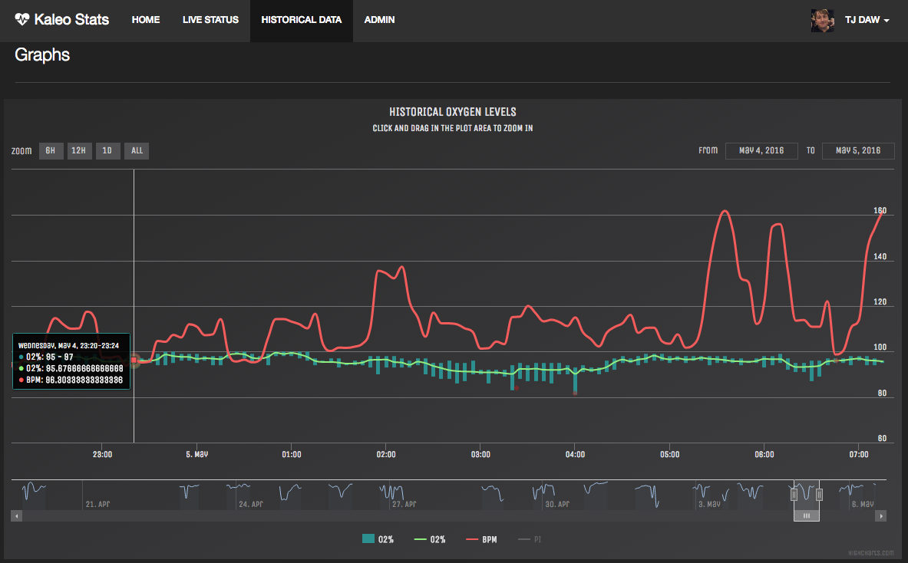
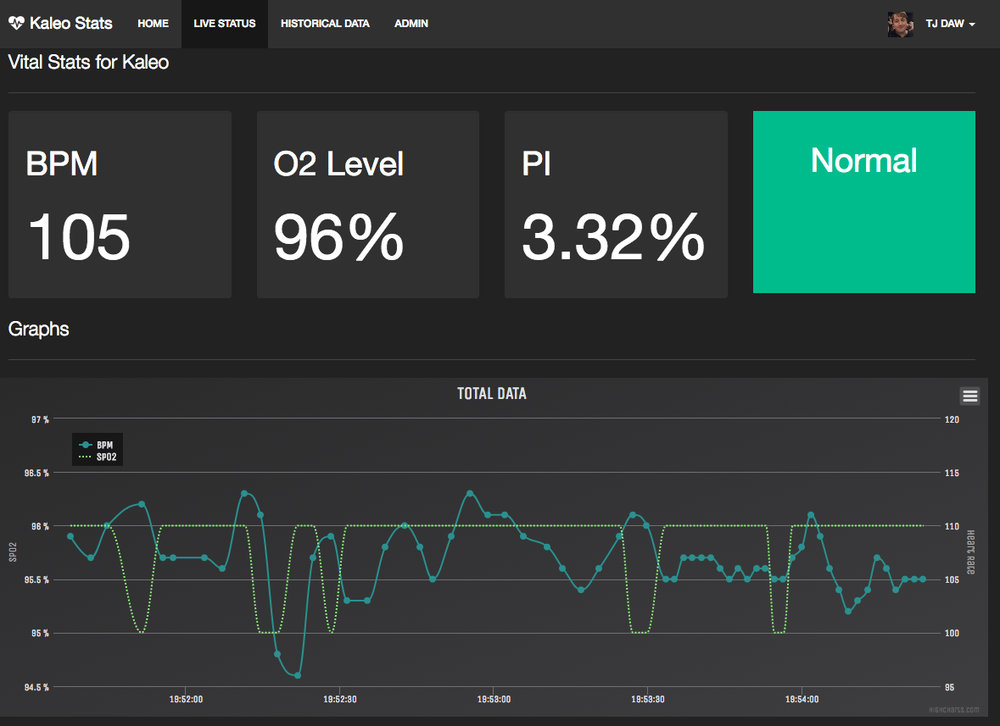
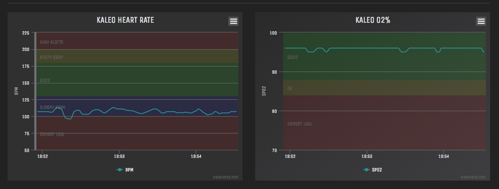

## Baby Monitor and Historical Data from a Masimo pulse oximeter

# Introduction

This project is used to record the Blood Oxygen levels of an infant who is monitored with the Masimo pulse oximeter. This data is uploaded to a MongoDB and used to populate a real time and historical graphs. Which can be used by parents at home to monitor an infant who is in another room or by a doctor to review large sections of time to see how and infant is doing. 

### Needed Hardware

* Masimo pulse oximeter (Currently RAD8 or RAD7)
* Serial to USB Cable
    *  I used this one from radio shack however you can get it online for much less. [Gigaware USB to Serial](https://www.radioshack.com/products/gigaware-usb-to-serial-cable?variant=5717179013)
* Raspberry PI [Raspberry PI 2](http://www.amazon.com/gp/product/B00T2U7R7I?psc=1&redirect=true&ref_=oh_aui_detailpage_o07_s01)
* Wifi Adapter [Edimax EW-7811Un](http://www.amazon.com/gp/product/B003MTTJOY?psc=1&redirect=true&ref_=oh_aui_detailpage_o07_s00)
* Power Cable, I used an old cell phone charger that I had around but you can get one on amazon.   [CanaKit 5V ](http://www.amazon.com/CanaKit-Raspberry-Supply-Adapter-Charger/dp/B00MARDJZ4/ref=pd_sim_147_3?ie=UTF8&dpID=51KgJwxynLL&dpSrc=sims&preST=_AC_UL160_SR160%2C160_&refRID=18DDK0DC8G9HYQ37XBW0)

