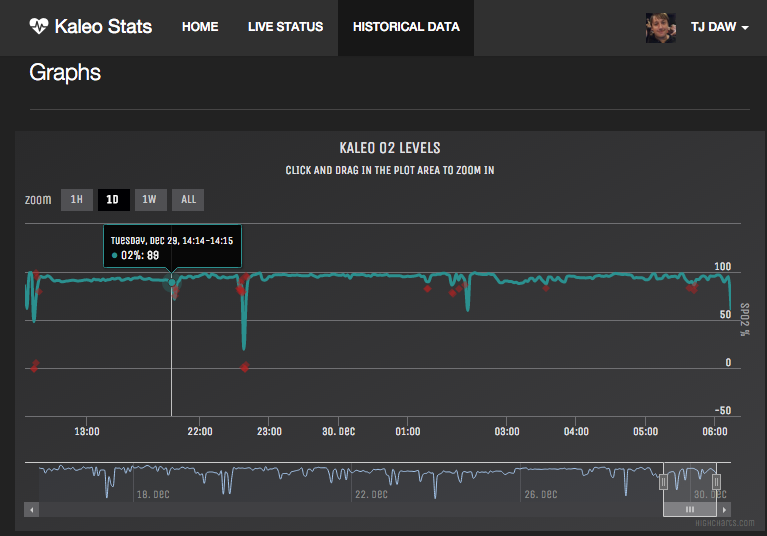

## Baby Monitor and Historical Data from a Masimo Rad 8

# Introduction

This project is used to monitor the Blood Oxygen levels of an infant who is monitored with the Masimo RAD 8. This data is uploaded to a MongoDB and used to populate a real time and historical graphs. Which can be used by Parents at home to monitor an infant who is in another room or by a doctor to review large sections of time to see how and infant is doing. 

